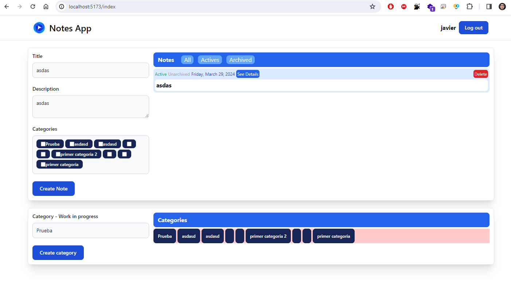

# Frontend Challenge
## Technologies:
- Node v20.12.0
- Npm v10.5.0
- React v18.2.0
****
The backend is finished, but on the frontend, I got stuck at this part.

****

## To test the frontend on your computer, you must have the following technologies installed:
- Node v20.12.0
- Npm v10.5.0
## How to run the backend:
1. Clone the repository
2. In the directory C:\ {your path} \Huebra-7156ad\backend\challenge_front run the next bash command:
```bash
 ./runfrontend.sh
```
If you can't run bash commands, you can run the following commands:
```
- npm install
- npm run dev
```
3. The frontend will be running on http://localhost:5173

Other features that I am capable of adding to the frontend:
```
- Design adaptable to various screens.
- Mobile application built with React Native and its deployment on the Play Store.


```